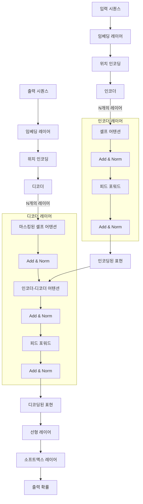

## 📅 날짜: 2025-03-10

### 💬 스크럼
- 학습 목표 1 : NLP, TextCNN, GAN
- 학습 목표 2 : Transformer
  
### 📒 공부한 내용
---
### NLP

NLP : 인간의 언어 현상을 컴퓨터와 같은 기계를 이용해서 묘사할 수 있도록 연구하고 이를 구현하는 인공지능의 분야
  
| 단계 | 설명 | 관계 및 데이터 흐름 | 예시 |
| --- | --- | --- | --- |
| 사용자 입력 | 사용자로부터 음성 또는 텍스트 입력을 받는 단계 | 사용자 → 입력 (음성 또는 텍스트) | 사용자가 "What's the weather like today?"라고 텍스트로 질문 |
| 전처리 | 입력된 음성/텍스트를 처리하기 위해 전처리를 수행하는 단계 | 입력 (음성 또는 텍스트) → 전처리 | "what's the weather like today?"로 소문자로 변환하고, "what's"를 "what is"로 표준화 |
| 형태소 분석 | 전처리된 데이터를 형태소(어절) 단위로 분석하는 단계 | 전처리 → 형태소 분석 ↔ Data / Knowledge Base (형태소/어휘/전문 용어 사전) | "what/PRON is/VERB the/DET weather/NOUN like/ADP today/NOUN"와 같이 단어를 품사 단위로 태깅 |
| 벡터화 | 형태소 분석된 텍스트를 숫자 벡터로 변환하는 단계 | 형태소 분석 → 벡터화 | "What's the weather like today?" → [0, 1, 0, 2, ...] (단어 빈도 벡터) |
| 구문 분석 | 형태소 분석 결과를 기반으로 구문(문장 구조)을 분석하는 단계 | 형태소 분석 → 구문 분석 ↔ Data / Knowledge Base (형태소/어휘/전문 용어 사전) | "What is the current state of the weather today?"와 같은 문장 구조로 해석 |
| 후처리 | 구문 분석 결과를 기반으로 후처리를 수행하여 **최종 결과** 생성 | 구문 분석 → 후처리 | "Today's weather is sunny in Seoul"과 같이 답변을 생성 |
| 결과 출력 | 후처리된 결과를 사용자에게 전달하는 단계 | 후처리 → 출력 (음성 또는 텍스트) → 사용자 | "Today's weather is sunny in Seoul"이라고 음성 또는 텍스트로 사용자에게 전달 |

  
NLP : 문서 요약, 고급 검색, 번역, 감성 분석, 음성 인식, 챗봇 등

목표 : 사람 언어 이해, 소통
  
벡터화 : 전체적인 시스템을 수치화

벡터화 방법 2가지

- BoW : bag of words, 단순하게 문서 내 단어의 등장 빈도수를 고려해 벡터 구성
- TF-IDF : 단어 빈도와 그 단어가 다른 문서에 등장하는 빈도를 결합해 가중치 부여
    
    (term frequency - inverse document frequency)
    
  
다항 나이브 베이즈 : 텍스트 분류에서 자주 사용하는 확률 기반 머신러닝 알고리즘으로, 문서 내 단어의 등장 빈도를 기반으로 문서가 특정 범주(클래스)에 속할 확률을 계산해 분류하는 기법. 주로 스팸 메일 필터링, 뉴스 기사 분류, 감성 분석 등에 활용됨

---

RNN : 순차적인 데이터(텍스트, 시계열) 처리를 위해 설계된 신경망
  
은닉 상태 : 이전 정보가 현재 결과에 영향을 주도록 도움 (기억 장치처럼 동작함)

- 이전 시점의 정보를 기억하는, 즉 ‘맥락’이 생기게 됨
- 작동 방식 : 과거 정보를 가중치로 곱한 뒤 현재 입력 정보와 결합 후 다음 단계로 전달
- 단점 : 가중치가 곱해지는 구조로 인해 시퀀스가 길어질수록 초기 단계의 정보가 희미해지는 소실 문제가 있음
  
예시)
1. I를 입력받음 → 대명사로 예측 → 다음 은닉층으로 정보 전달
2. work 입력 → 이전 은닉상태 + 현재 정보를 통해 동사로 예측 → 다음 전달
3. at 입력 → 이전 상태(work 동사) , at 전치사로 예측 → 다음 전달…

---

LSTM : 기존 RNN 단점을 보완해 장/단기 기억을 가능하게 설계한 신경망 구조

- 기본적으로 RNN 베이스임
- 긴 시간 동안의 정보를 자연스럽게 기억할 수 있음  

게이트 : 정보 흐름을 조절하는 가중치 연산 블록 (입력 받으면 조건에 따라 계산하는 블록)

- 입력 게이트 : 새 정보를 셀 상태에 얼마나 추가할지 결정
- 망각 게이트 : 이전 셀 상태에서 어떤 정보를 유지하고 잊을지 결정
- 출력 게이트 : 현재 셀 상태 바탕으로 최종 출력을 어떻게 할지 결정
  
1. 입력 받아 각 게이트 통과
    1. 현재 입력, 이전 히든 상태가 망각 게이트, 입력 게이트로 들어감
    2. 망각 게이트에서 판단 후 삭제/유지
    3. 입력 게이트에서 얼마나 받아들일지 결정
    4. tanh 에서 새 정보를 위해 변환된 값(셀 상태) 생성
2. 셀 상태 업데이트
    1. 망각 게이트 결과와 이전 셀 상태가 곱해져 유지할 부분 결정
    2. 입력 게이트와 셀 상태가 곱해져 새로운 정보 얼마나 추가할지 결정
    3. 업데이트된 새로운 셀 상태 생성
3. 최종 히든 스테이트(출력) 계산 및 전달
    1. 결과가 tanh 로 전달되어 범위 조절
    2. output gate로도 동시에 전달 (최종 출력값 얼마나 활성화할지 결정)
    3. output gate와 tanh 결과를 곱해 최종 출력 및 다음 시점의 hidden state로 동시에 전달

---

### Text CNN, GAN

Text CNN : 텍스트 데이터를 처리하기 위한 CNN 모델

- CNN은 이미지 처리에 사용되었지만, 텍스트 데이터 처리에서도 성능이 좋다는 것이 증명됨
- 입력 텍스트 : 원본 텍스트 데이터 입력
- 단어 임베딩 : 단어 벡터로 변환
- 컨볼루션 레이어 : 텍스트에서 특징 추출
- 맥스 풀링 : 중요한 특징 선택
- 연결 레이어 : 추출 특징 결합하여 고수준 특징 학습
- 소프트맥스 : 최종 분류를 위해 확률분포 생성
- 출력 : 최종 분류 결과 출력
  
소프트맥스 : 0과 1 사이 값으로 변환하고, 값들의 합이 1이 되도록 하는 활성화 함수

- 즉 정확하게 확률 분포를 만드는 점에서 시그모이드와 차이가 있음
- 다중 클래스 분류 문제에서 사용
  
단어 임베딩 : 단어를 고정된 크기의 수치 벡터로 변환하여 의미적 유사성을 표현한 것

- 비슷한 의미 단어들은 벡터 공간에서 가깝게 위치
  
컨볼루션 레이어 : n-그램 특징 추출

- n-그램 : 연속된 n개의 단어 의미, 문맥을 유지하며 추출 가능
- 텍스트 데이터의 공간적 구조를 유지하며 특징 추출 가능
  
즉 ‘뭉처 있는’ 것을 CNN이 잘 다루므로 텍스트 처리에 사용함

---

GAN : 두 신경망이 경쟁적으로 학습하여, 하나는 위조 데이터를 생성하고 다른 하나는 이를 판별하며 서로의 성능을 개선하는 딥러닝 모델

- 목적 : 고품질 데이터 증강(생성), 복원 등에 사용
  
생성자 : 무작위 노이즈 벡터를 입력받아 가짜 데이터 생성

판별자 : 가짜 데이터를 입력받아 구분함

---

### Transformer

Transformer : attension 매커니즘을 통해 병렬 처리를 하여 단어 간의 관계를 빠르고 정확하게 학습할 수 있는 딥러닝 모델 아키텍처

- 이전에는 순차적으로 데이터를 처리했음
- 인코더 : 입력 시퀀스를 고차원 표현으로 변환
- 디코더 : 인코딩된 표현을 받아 원하는 출력 시퀀스 생성
- self-attention 매커니즘이 핵심임  

  
Self-Attention Mechanism

- 시퀀스 각 요소가 다른 모든 요소와의 관계를 고려하여 각각의 중요도를 구하고 자신을 다시 계산하는 메커니즘
- query와 key의 행렬곱으로 수행
- 이후 softmax로 정규화 (다 합해서 1이 되도록)
- 연관성(attention 가중치) : 학습 데이터를 통해 정해짐.
    - 예) 나는 아침에 커피를 마셨다 → 언어적 의미(목적어, 동사의 강한 연관성), 학습 데이터(책, 뉴스 등에서 커피를, 마셨다가 같이 등장함)
    - query : ‘커피를’ 이 다른 단어들과 얼마나 유사할까?
    - key : ‘나는’, ‘아침에’, ‘커피를’, ‘마셨다’ 각각의 고유한 정보
    - query와 key 간 내적 (유사도 계산)
    - softmax로 확률값으로 변환 (가중치로 변환)
    - 해당 가중치를 value(다른 단어들 정보) 에 곱해서 새로운 표현을 만듦

| **Query (현재 단어)** | **Key (비교 대상)** | **유사도 점수(Score)** | **Softmax 적용 후 (Attention Weight)** | **Value (원래 정보)** | **최종 결과 (가중합)** |
| --- | --- | --- | --- | --- | --- |
| **커피를** | 나는 | 0.2 | 0.1 | [1.0, 0.5] | 0.1 × [1.0, 0.5] |
| **커피를** | 아침에 | 0.5 | 0.2 | [0.7, 0.3] | 0.2 × [0.7, 0.3] |
| **커피를** | 커피를 | 1.5 | 0.4 | [1.5, 0.7] | 0.4 × [1.5, 0.7] |
| **커피를** | 마셨다 | 1.2 | 0.3 | [1.2, 0.6] | 0.3 × [1.2, 0.6] |
  
Multi-Head Attention

- H개의 독립적인 Attention Head를 동시에 계산한 후, 최종적으로 하나로 합치는 방식

| **Head** | **학습하는 패턴** |
| --- | --- |
| Head 1 | 주어(“나는”)와 동사(“마셨다”)의 관계 학습 |
| Head 2 | “아침에”와 “커피를”의 관계 학습 (시간 & 목적어 연결) |
| Head 3 | “커피를”과 “마셨다”의 관계 학습 (음식 & 행동 연결) |
  
- 여러 패턴 동시 학습 가능
- 장기적인 관계, 단기적 관계 모두 학습 가능
- 병렬 연산 가능 (동시에 계산됨)

---

### 한 줄 정리

| 개념 | 정리 |
| --- | --- |
| NLP (Natural Language Processing - 자연어 처리) | 인간 언어의 특성을 컴퓨터를 통해 모델링해 텍스트 및 음성 데이터를 분석, 이해, 생성하는 인공지능 분야 |
| RNN (Recurrent Neural Network) | 시퀀스 데이터 처리를 위해 이전 은닉 상태를 순환적으로 전달하여 패턴을 학습하는 신경망 구조 |
| LSTM (Long Short-Term Memory) | 입력, 망각, 출력 게이트를 도입해 RNN에서 발생하는 기울기 소실 문제를 완화하고 장기 의존성을 효과적으로 학습할 수 있도록 설계된 모델 |
| Word Embedding | 단어를 숫자 벡터로 변환하여 단어들 간의 의미적 유사성과 관계를 연속된 벡터 공간에서 효과적으로 표현하는 기법 |
| GAN (Generative Adversarial Network) | 생성자와 판별자가 적대적 학습을 통해 서로 경쟁하며 현실적인 데이터를 모방해 생성하는 딥러닝 프레임워크 |
| Transformer Model | 멀티헤드 어텐션 매커니즘을 통해 순차 처리가 아닌 병렬 처리를 하여 전체 단어 간의 관계를 빠르고 정확하게 모델링하는 딥러닝 아키텍처 |
| Attention Machanism | 각 입력 요소가 문맥 내 다른 모든 요소와의 상호 관계를 평가하고 중요도에 따라 가중치를 할당함으로써, 멀리 떨어진 요소 간의 의존성도 효과적으로 반영하는 기법 |

---

### 📁 참고 자료 및 링크
- Alex 강의
